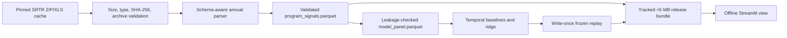
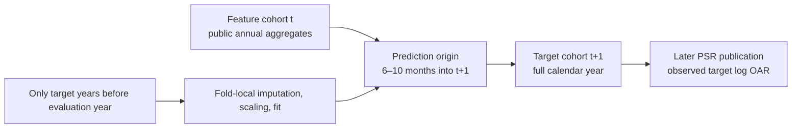

# Kidney Acceptance Signal Monitor

An offline-capable public-data screening signal for kidney transplant program
quality-improvement review. It shows longitudinal SRTR-published offer-acceptance ratios (OARs),
their published 95% credible intervals, donor-stratum context, and a separately evaluated
next-calendar-year PSR projection.

> Public aggregate prototype — not clinical or regulatory decision support.

For an ordinary-language explanation of V1, the completed V2 study, and the two planned
investigations, start with [Understanding the project](docs/project-guide.md).
[Plan 0020](docs/plans/0020-v2-follow-up-and-interview-story.md) describes the follow-up and
20-minute interview presentation. Its first pass will rewrite existing documentation in ordinary
language while preserving the original facts. The analytical follow-up comes afterward. That work
is planned; the original V2 results and release remain available. The commands and four-minute demo
below describe the retained V1 product.

The frozen 2025 retrospective replay did not promote ridge: although ridge improved log-OAR MAE
by 10.13%, its absolute mean signed error exceeded persistence. The application therefore carries
the latest published OAR forward as its displayed projection and suppresses the ridge empirical
band. This is an intentional, prespecified negative selection result.

## Start the tracked offline demo

Python 3.12 and [`uv`](https://docs.astral.sh/uv/) are required. After the locked environment has
been installed, the application reads the checked-in bundle under `artifacts/release/` and makes
no network requests:

```powershell
$env:UV_CACHE_DIR = "$PWD/.uv-cache"
uv sync --frozen
uv run streamlit run app/streamlit_app.py
```

Open <http://localhost:8501>. No raw workbook, model fitting, or live source is needed at app
startup. `KASM_ARTIFACT_DIR` and `KASM_MODELING_DIR` may override the default release paths for
development or an audited reproduction.

## Four-minute offline demo

1. **Problem (30 seconds):** explain that public program-level OARs compare observed with expected
   acceptances and can support quality-improvement review, not offer-level decisions.
2. **History (75 seconds):** select a program; show its non-overlapping annual overall OARs, SRTR
   credible intervals, published date, volume, and explicit interval-status text.
3. **Strata (45 seconds):** scan low-, medium-, high-KDRI and hard-to-place history. Point out that
   missing values are “Not reported” and hard-to-place offers overlap KDRI strata.
4. **Projection (45 seconds):** show the eligible persistence next-calendar-year PSR projection,
   prediction origin, and elapsed target-cohort fraction; call it a delayed-report nowcast.
5. **Validity and result (45 seconds):** open model evaluation. Show intact target-year folds,
   the frozen 2025 descriptive replay, ridge non-promotion, and band suppression.

Networking can be disabled after `uv sync`; the critical path is covered by an offline Streamlit
AppTest and a process health smoke test.

The interview package includes an [eight-slide presentation](docs/presentation/kidney-acceptance-signal-monitor-interview.pptx),
a [rehearsal and likely-question guide](docs/presentation/interview-rehearsal-guide.md), and three
wide [backup screenshots](docs/demo/) of the tracked offline flow.

## Methodology in brief

- The modeling unit is `(CTR_CD, CTR_TY) × calendar year`, never a patient or offer.
- Nine checksum-pinned SRTR releases supply non-overlapping 2017–2025 calendar-year cohorts.
- The target is next-calendar-year published `log(OAR)`, not credible-interval status.
- Neutral, persistence, and historical-mean baselines precede one ridge challenger.
- Rolling-origin target years remain intact; preprocessing is fit inside each training fold.
- Ridge alpha 10 was frozen before the write-once 2025 replay. The replay fit uses targets through
  2023; 2024 outcomes calibrate the separate empirical-band rule and never enter that fit.
- The 2025 replay is descriptive retrospective product-selection evidence, not prospective or
  independent validation.

Full scientific requirements live in `SPEC.md`; execution status is in `PLAN.md`. See
`docs/data_card.md`, `docs/model_card.md`, and `docs/reproduction_log.md` for the release evidence.

## Architecture



The Streamlit process is a view layer. It reads trusted Parquet and JSON only; acquisition,
parsing, validation, feature construction, fitting, and artifact publication stay in importable
modules and command-line boundaries.

## Cohort-to-target method



This timing makes the output a next-calendar-year PSR projection and delayed-report nowcast, not a
real-time or clean 12-month-ahead forecast.

## Reproduce the canonical pipeline

Source reacquisition is a separate, networked maintenance action:

```powershell
uv run kasm data sync
```

Release reproduction begins from the immutable verified cache and stays offline. Use a fresh audit
root so the canonical write-once replay is never overwritten:

```powershell
$audit = "data/m6-reproduction"
uv run kasm data verify-cache
uv run kasm data build --output-dir "$audit/processed"
uv run kasm model backtest --panel-path "$audit/processed/model_panel.parquet" --output-dir "$audit/modeling"
uv run kasm model evaluate-frozen-replay --confirm --panel-path "$audit/processed/model_panel.parquet" --output-root "$audit/modeling/frozen-replay"
uv run kasm artifacts build --processed-dir "$audit/processed" --modeling-dir "$audit/modeling" --output-dir "$audit/release"
```

`artifacts build` requires exactly one completed replay, binds every payload to its canonical hash,
copies only the approved 12 files, writes an attributed manifest, enforces the 5 MiB ceiling, and
publishes the directory atomically. The checked-in bundle content identity is
`1de89083ceebfda9afaf2d6b1c6ba3f1e6d0c1a1da16df9d09d994c4ec3581ad`.

### Optional patient-journey v2 research build

The separate v2 study is governed by `docs/specs/patient-journey-v2.md` and does not change the v1
application or frozen evaluation. From the same verified source cache, reproduce the complete V2
evidence and offline bundle with:

```powershell
uv run kasm patient-journey data build
uv run kasm patient-journey model evaluate
uv run kasm patient-journey artifacts build
uv run streamlit run app/patient_journey_v2.py
```

The commands write only to V2-owned roots declared in
`configs/patient_journey_v2/experiment.yaml`. They atomically publish and validate the processed
panel and safety table, the prespecified retrospective evaluation, and the self-contained
bundle under `artifacts/patient_journey_v2/`. A dirty-worktree build is explicitly marked
noncanonical.

The V2 app is a separate research entry point. It does not replace `app/streamlit_app.py`, generate
a future forecast, rank programs, or promote a model. Ridge evidence is limited to one
strict-publication-vintage fold and remains permanently nonpromotional. See
`docs/patient_journey_v2_data_card.md`, `docs/patient_journey_v2_model_card.md`, and
`docs/patient_journey_v2_reproduction_log.md` for the exact data contract, results, and build
identities.

## Verification

```powershell
$env:UV_CACHE_DIR = "$PWD/.uv-cache"
uv sync --frozen
uv run ruff format --check .
uv run ruff check .
uv run mypy src/kasm
uv run pytest -q --cov=src/kasm/data --cov=src/kasm/modeling --cov=src/kasm/reporting --cov=src/kasm/patient_journey --cov-branch --cov-fail-under=80
uv run coverage report --include="src/kasm/patient_journey/*" --fail-under=80 --precision=2
docker build -t kidney-acceptance-signal-monitor .
docker run --rm -p 8501:8501 kidney-acceptance-signal-monitor
```

The image declares user `kasm` (UID 10001), reads the tracked bundle by default, and checks
`/_stcore/health` without requiring an external utility.

The [AI-generated code and context audit](docs/ai-code-and-context-audit.md) records the
research basis, repository findings, implemented guardrails, and residual risks for AI-assisted
maintenance.

## Data, attribution, and licensing boundary

SRTR is the authoritative source for the Program-Specific Report materials. Its
[citations and permissions page](https://srtr.hrsa.gov/requesting-data/citations-and-permissions/)
states that website material is not copyrighted and may be used without permission when
appropriately cited. This repository does not redistribute raw SRTR workbooks; it tracks a small
attributed derivative bundle of public aggregate fields needed for the offline demonstration.
Source URLs, exact hashes, methods, and permissions guidance are preserved in
`configs/data_sources.yaml` and the release manifest.

Repository code is available under the MIT License in `LICENSE`. That license applies to the code,
not to third-party dependencies and not as a substitute for the source attribution described
above. Dependencies retain their own licenses.
