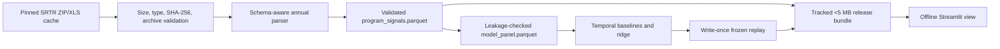
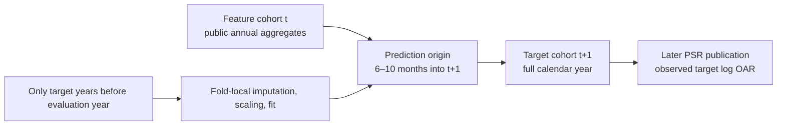

# Kidney Acceptance Signal Monitor

An offline public-data tool for kidney transplant programs reviewing their offer-acceptance
history. It displays the Scientific Registry of Transplant Recipients (SRTR) published
offer-acceptance ratio (OAR): how acceptances compare with the number expected for the offers
received. It also shows SRTR's published 95% uncertainty intervals, patterns in donor groups,
and a separately evaluated next-calendar-year Program-Specific Report (PSR) projection.

> Public aggregate prototype — not clinical or regulatory decision support.

Start with [Understanding the project](docs/project-guide.md) for the questions, results and
limits of V1 and the separate V2 patient-journey study. The
[project walkthrough](docs/presentation/data-walkthrough/README.md) presents both studies and
their follow-ups. [PLAN.md](PLAN.md) links current work and completed implementation evidence.

V2's [report-count follow-up](docs/patient_journey_v2_followup_results.md) found that removing
the number of earlier available reports reduced history-only Ridge's average error from 11.49
to 7.32 percentage points. Acceptance then added a 0.09-point improvement on the same 218
programs. Its [outcome-component analysis](docs/patient_journey_v2_component_results.md) found a
median 16.05% of the original listing group with unknown post-transplant status. This is a
program median, not a pooled patient percentage or an explanation of prediction error. Both
investigations describe already-inspected outcomes and preserve the original V2 results.

The separate [deceased-donor receipt study](docs/deceased_donor_receipt_results.md) is also
complete. Across two evaluation periods, adding acceptance to receipt history and access
information reduced average error from 8.888 to 8.774 percentage points. The 0.113-point
(1.27%) improvement missed the fixed continuation rule and did not occur in both periods,
so development of that acceptance extension stops. Both periods use the same earlier training
cohort; the result remains exploratory and promotes no model.

The commands below open and reproduce the released V1 product.

The released application displays historical measures and persistence, which carries the latest
ratio forward. Ridge reduced average absolute log error by 10.13% in the original retrospective
2025 comparison. The exact-bias rule that blocked it was a design mistake and is retired.
The [original model card](docs/model_card.md) retains the numerical audit record.

[Plan 0027](docs/plans/0027-v1-forecast-improvement.md) is complete. Its fixed five-method comparison
selects a fitted adjustment of the latest ratio as a provisional research candidate, with 6.90% lower
average absolute log error than persistence. Its edge over full Ridge is small (0.66%), and its
forecast band fails the separate coverage criteria. See the [results and reproduction commands](docs/acceptance_forecast_results.md).
The fixed comparison's thresholds are research judgments, not evidence of user benefit.
[Decision 0016](docs/decisions/0016-retire-bias-gate-and-correct-readiness.md) separates model
choice from deployment suitability. [Plan 0029](docs/plans/0029-interview-readiness-corrections.md)
addresses source definitions, trusted loading and presentation corrections. A future release
still requires the separate [Plan 0028 handoff](docs/plans/0028-v1-point-projection-release.md).

SRTR changed which offers count in the July 2025 and January 2026 reports. The
[source-definition audit](docs/audits/source-definition-0029.md) records the two changes and
the limits of comparing published OARs across them. Historical score differences do not
separate a change in program behavior from a change in measurement.

## Start the tracked offline demo

Python 3.12 and [`uv`](https://docs.astral.sh/uv/) are required. After the locked environment has
been installed, the application reads the checked-in bundle under `artifacts/release/` and makes
no network requests:

```powershell
$env:UV_CACHE_DIR = "$PWD/.uv-cache"
uv sync --frozen
uv run streamlit run app/streamlit_app.py
```

Open <http://localhost:8501>. No raw workbook, model fitting, or live source is needed at app
startup. To use a copied or reproduced complete release, set `KASM_ARTIFACT_DIR` to its
`processed` directory and `KASM_MODELING_DIR` to its sibling `modeling` directory. Both must
belong to the same release with a valid manifest and payload hashes. Bare analysis directories
and mixed releases fail before display; there is no validation bypass for overrides.

## Four-minute offline demo

1. **Problem (30 seconds):** explain that public program-level OARs compare observed with expected
   acceptances and can support quality-improvement review, not offer-level decisions.
2. **History (75 seconds):** select a program; show its non-overlapping annual overall OARs, SRTR
   credible intervals, published date, volume, and explicit interval-status text.
3. **Strata (45 seconds):** scan the low-, medium-, high-KDRI donor-risk groups and hard-to-place
   history. Point out that
   missing values are “Not reported” and hard-to-place offers overlap KDRI strata.
4. **Projection (45 seconds):** show the eligible persistence next-calendar-year PSR projection,
   prediction origin, and elapsed target-cohort fraction; call it a delayed-report nowcast.
5. **Validity and result (45 seconds):** open model evaluation. Explain the average error,
   individual misses, changing source definitions and why the forecast band remains unavailable.

Networking can be disabled after `uv sync`; the critical path is covered by an offline Streamlit
AppTest and a process health smoke test.

Use the [current project walkthrough](docs/presentation/data-walkthrough/README.md) for corrected
slides and notes. The original eight-slide deck and [backup screenshots](docs/demo/) preserve
the earlier release appearance and are superseded presentation material.

## Methodology in brief

- One record represents one transplant program and calendar year, identified by
  `(CTR_CD, CTR_TY) × calendar year`, never a patient or offer.
- Nine exact SRTR releases, identified by their file fingerprints, supply non-overlapping
  2017–2025 calendar-year cohorts.
- The target is next-calendar-year published `log(OAR)`, not credible-interval status.
- Neutral, persistence, and historical-mean baselines precede one ridge challenger.
- Each evaluation uses earlier years to predict a later year (a rolling-origin fold). All
  programs from the later year stay together. Missing-value filling and input scaling learn
  only from the training years.
- Ridge alpha 10 was frozen before the write-once 2025 replay. The replay fit uses targets through
  2023; 2024 outcomes calibrate the separate empirical-band rule and never enter that fit.
- The 2025 replay is descriptive retrospective product-selection evidence, not prospective or
  independent validation.

Full scientific requirements live in [SPEC.md](SPEC.md); execution status is in [PLAN.md](PLAN.md).
See the [data card](docs/data_card.md), [model card](docs/model_card.md), and
[reproduction log](docs/reproduction_log.md) for the release evidence.

## Architecture



The Streamlit process is a view layer. It reads trusted Parquet and JSON only; acquisition,
parsing, validation, feature construction, fitting, and artifact publication stay in importable
modules and command-line boundaries.

## Cohort-to-target method



This timing makes the output a next-calendar-year PSR projection and delayed-report nowcast, not a
real-time or clean 12-month-ahead forecast.

## Reproduce the canonical pipeline

Source reacquisition is a separate, networked maintenance action:

```powershell
uv run kasm data sync
```

Release reproduction begins from the immutable verified cache and stays offline. Use a fresh audit
root so the canonical write-once replay is never overwritten:

```powershell
$audit = "data/m6-reproduction"
uv run kasm data verify-cache
uv run kasm data build --output-dir "$audit/processed"
uv run kasm model backtest --panel-path "$audit/processed/model_panel.parquet" --output-dir "$audit/modeling"
uv run kasm model evaluate-frozen-replay --confirm --panel-path "$audit/processed/model_panel.parquet" --output-root "$audit/modeling/frozen-replay"
uv run kasm artifacts build --processed-dir "$audit/processed" --modeling-dir "$audit/modeling" --output-dir "$audit/release"
```

`artifacts build` requires exactly one completed replay, binds every payload to its canonical hash,
copies only the approved 12 files, writes an attributed manifest, enforces the 5 MiB ceiling, and
publishes the directory atomically. The checked-in bundle content identity is
`1de89083ceebfda9afaf2d6b1c6ba3f1e6d0c1a1da16df9d09d994c4ec3581ad`.

### Optional patient-journey v2 research build

The separate v2 study is governed by `docs/specs/patient-journey-v2.md` and does not change the v1
application or frozen evaluation. From the same verified source cache, reproduce the complete V2
evidence and offline bundle with:

```powershell
uv run kasm patient-journey data build
uv run kasm patient-journey model evaluate
uv run kasm patient-journey artifacts build
uv run streamlit run app/patient_journey_v2.py
```

The commands write only to V2-owned roots declared in
`configs/patient_journey_v2/experiment.yaml`. They atomically publish and validate the processed
panel and safety table, the prespecified retrospective evaluation, and the self-contained
bundle under `artifacts/patient_journey_v2/`. A dirty-worktree build is explicitly marked
noncanonical.

The V2 app is a separate research entry point. It does not replace `app/streamlit_app.py`, generate
a future forecast, rank programs, or promote a model. Ridge evidence is limited to one
evaluation period for which earlier training outcomes had already been published (the
strict-publication-vintage rule). These results cannot qualify a model for display. See the
[V2 data card](docs/patient_journey_v2_data_card.md), [V2 model card](docs/patient_journey_v2_model_card.md),
and [V2 reproduction log](docs/patient_journey_v2_reproduction_log.md) for the exact data contract,
results, and build identities.

## Verification

```powershell
$env:UV_CACHE_DIR = "$PWD/.uv-cache"
uv sync --frozen
uv run ruff format --check .
uv run ruff check .
uv run mypy src/kasm
uv run pytest -q --cov=src/kasm/data --cov=src/kasm/modeling --cov=src/kasm/reporting --cov=src/kasm/patient_journey --cov-branch --cov-fail-under=80
uv run coverage report --include="src/kasm/patient_journey/*" --fail-under=80 --precision=2
docker build -t kidney-acceptance-signal-monitor .
docker run --rm -p 8501:8501 kidney-acceptance-signal-monitor
```

The image declares user `kasm` (UID 10001), reads the tracked bundle by default, and checks
`/_stcore/health` without requiring an external utility.

The [AI-generated code and context audit](docs/ai-code-and-context-audit.md) records the
research basis, repository findings, implemented guardrails, and residual risks for AI-assisted
maintenance.

## Data, attribution, and licensing boundary

SRTR is the authoritative source for the Program-Specific Report materials. Its
[citations and permissions page](https://srtr.hrsa.gov/requesting-data/citations-and-permissions/)
states that website material is not copyrighted and may be used without permission when
appropriately cited. This repository does not redistribute raw SRTR workbooks; it tracks a small
attributed derivative bundle of public aggregate fields needed for the offline demonstration.
Source URLs, exact hashes, methods, and permissions guidance are preserved in
`configs/data_sources.yaml` and the release manifest.

Repository code is available under the MIT License in `LICENSE`. That license applies to the code,
not to third-party dependencies and not as a substitute for the source attribution described
above. Dependencies retain their own licenses.
