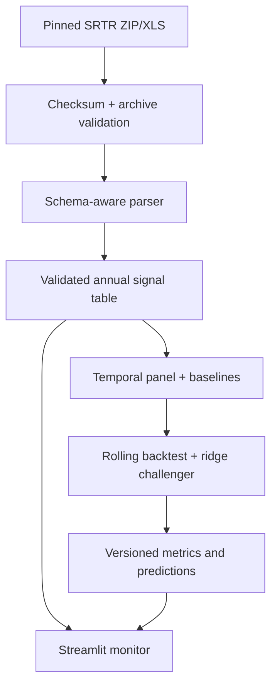

# Kidney Acceptance Signal Monitor

**Specification version:** 1.1  
**Status:** Approved for build  
**Specification date:** 2026-09-03  
**Primary audience:** Transplant-program quality and performance staff  

## 1. Decision summary

Build a public-data prototype that helps a kidney transplant program review its longitudinal, risk-adjusted offer-acceptance signals and compare them with national expectation. The guaranteed product is a historical monitor. An experimental model projects the program's **next same-cadence calendar-year PSR signal** and must meet prespecified descriptive promotion criteria against simple persistence before it can appear in the interface.

The model target is the next same-cadence calendar-year program-level **log offer-acceptance ratio**, not a binary flag. A binary label based on whether a credible interval falls below 1 partly measures program volume and statistical precision, so it is unsuitable as the primary modeling target.

The engineering spine mirrors `TexasReadmissionRiskAPI`—validated acquisition/ETL, feature construction, training, evaluation, user-facing delivery, CI, and Docker—but this batch, provider-level use case serves precomputed artifacts directly in Streamlit. A separate FastAPI service and cloud deployment are outside P0.

The product is a quality-improvement screening prototype. It does not:

- evaluate individual organ offers;
- determine whether a decline was appropriate;
- estimate preventable nonuse or causal effects;
- reproduce SRTR's offer-level risk model;
- reproduce OPTN Membership and Professional Standards Committee review criteria; or
- provide clinical, regulatory, or allocation advice.

## 2. Why the method is defensible

The broad pattern is already used in transplant and provider-quality work:

- OPTN program monitoring includes a one-year, risk-adjusted offer-acceptance ratio based on observed versus expected acceptances. The expected value accounts for donor, candidate, interaction, offer-sequence, and distance information. [HRSA overview](https://www.hrsa.gov/optn/news-events/news/new-pre-transplant-performance-metric-now-effect-offer-acceptance-rate-ratio)
- SRTR estimates expected acceptances with offer-level logistic models, sums the predicted probabilities, and publishes program ratios with uncertainty. [SRTR technical methods](https://srtr.hrsa.gov/transplant-professionals/program-specific-report/technical-methods-for-the-program-specific-reports/)
- UNOS Predict monitors and forecasts SRTR measures and added kidney offer-acceptance ratios in 2026. This validates the use case, although its algorithms and internal data are not public. [UNOS Predict 2.0](https://unos.org/news/unos-predict-2-0-allows-transplant-centers-to-make-smarter-data-driven-decisions/)
- SRTR has used risk-adjusted CUSUM charts for transplant-program quality improvement when event-level data are available. This project must not call its annual charts CUSUM or statistical process control because public PSRs lack the event sequence required for that method. [SRTR CUSUM publication](https://pubmed.ncbi.nlm.nih.gov/24502435/)
- CMS dialysis-facility measurement likewise uses observed-to-expected ratios, uncertainty intervals, and minimum-information safeguards. [CMS ESRD Measures Manual](https://www.cms.gov/files/document/esrd-measures-manual-v11-1.pdf)

The closest accurate description is:

> A public-data, program-level quality-improvement monitor with a separately evaluated next-calendar-year delayed-report nowcast.

It is an independent portfolio project, not a reproduction of or substitute for any UNOS, OPTN, or SRTR product.

## 3. User and decision

### Primary user

A kidney transplant program's quality director, data analyst, administrator, or clinical operations leader preparing for an offer-review or performance-improvement meeting.

### User question

> Is the program's published offer-acceptance signal stable, improving, or worsening; in which SRTR donor strata is the pattern visible; and does a simple model add useful information beyond assuming that the current signal will persist?

### Intended action

Use the result to decide where additional internal review may be worthwhile. A signal may prompt the program to examine its own offer-level data, workflow, filters, staffing, or criteria. The application itself does not prescribe an intervention.

## 4. Goals and non-goals

### Goals

1. Reproduce a deterministic annual panel from public SRTR kidney PSR workbooks.
2. Present published program ratios and their SRTR credible intervals without changing their meaning.
3. Show overall, low-KDRI, medium-KDRI, high-KDRI, and hard-to-place signals over time.
4. Compare a neutral benchmark, persistence, historical mean, and one regularized challenger model.
5. Evaluate strictly forward in time with one-year, non-overlapping cohorts.
6. Keep source uncertainty and forecast uncertainty visibly separate.
7. Deliver a reproducible, tested, containerized, offline-capable application.
8. Produce an honest model card, including a useful negative result if the challenger does not beat persistence.

### Non-goals

- Patient-level or candidate-donor prediction
- Real-time monitoring
- Center rankings or league tables
- Causal inference or counterfactual intervention claims
- Recreating SRTR expected acceptances from public aggregate data
- Predicting MPSC review, compliance, or regulatory status
- Fairness claims at the patient level
- External geographic or social-risk data joins
- A separate production API, cloud infrastructure, authentication, or multi-user administration
- Deep learning, boosted-tree model search, SHAP, or automated feature discovery

## 5. Source measure and terminology

For a program and annual cohort, SRTR publishes:

- observed acceptances, where only offers resulting in completed transplants count as accepted;
- expected acceptances, calculated by summing probabilities from SRTR's national offer-level models;
- the offer-acceptance ratio (OAR); and
- a 95% credible interval for the published ratio.

The published workbook values are reproduced within source rounding by:

$$
\mathrm{OAR}=\frac{O+2}{E+2},
$$

where \(O\) is observed acceptances and \(E\) is expected acceptances. This is a reconstruction check, not a claim to restate SRTR's full Bayesian method. The workbook's published OAR is authoritative because public expected counts and displayed ratios are rounded.

Interpretation:

- OAR = 1: acceptance is in line with national expectation for similar offers.
- OAR < 1: acceptance is lower than expected.
- OAR > 1: acceptance is higher than expected.

The application may describe a historical interval only with these mechanical labels:

- **95% interval entirely below 1:** published upper credible bound < 1;
- **95% interval includes 1:** published lower bound ≤ 1 ≤ published upper bound; or
- **95% interval entirely above 1:** published lower credible bound > 1.

These are descriptive, pointwise labels for the public PSR, not OPTN flags. There is no multiplicity adjustment across roughly 230 programs or across donor strata. The application must never display or approximate MPSC criteria.

"Hard-to-place" follows the SRTR table definition: offers occurring at offer sequence greater than 100, after more than 100 prior offers. Low-, medium-, and high-KDRI strata partition most offers. Hard-to-place and KDPI ≥60 strata can overlap those KDRI groups and must not be summed or described as explaining the overall result.

## 6. Data scope

### Source

[SRTR national center-level Program-Specific Report workbooks](https://srtr.hrsa.gov/transplant-professionals/program-specific-report/program-specific-reports-psr/), kidney only.

The build uses nine non-overlapping calendar-year offer cohorts from 2017 through 2025. Source URLs and verified hashes are pinned in `configs/data_sources.yaml`.

### Verified feasibility, not assumed availability

On 2026-09-03, all nine public sources downloaded successfully: about 94 MiB total. All nine download hashes and eight archive-member hashes were verified, both historical sheet-name variants parsed, and required center fields were present. Releases contained 230–240 program rows; adjacent annual releases yielded 229–238 matched composite-key program transitions. The build must recheck these contracts on day one, but data discovery is not on the critical path.

### Primary source table

The machine fields are found in:

- `Table B10 & Figures B7-B11` in older workbooks; and
- `Table B11 & Figures B10-B14` in newer workbooks.

The parser must locate the sheet using the manifest and required machine-readable columns, never by sheet position. Row 0 contains human-readable descriptions; program records begin on the following row.

### Directory table

The current workbook's `Tiers` sheet supplies display-only city, state, ZIP, and center name. Location and identity may not enter the model.

### Program identity

The key is `(CTR_CD, CTR_TY)`, serialized as `center_code:center_type`. `CTR_CD` alone is not unique in older releases because a transplant program and a Veterans Administration program can share a code.

Names are labels only and must never be used as join keys.

### Cohort cadence

Only calendar-year cohorts enter modeling. January and July PSRs are offset by six months, so adjacent semiannual reports share approximately half of their offers. Pooling them would overstate sample size and leak temporal information.

### Reporting lag

Calendar-year cohort `t` is typically published around July of `t+1`, roughly six months after the cohort ends; historical releases arrived about 6–10 months after cohort end and 9–13 months after the preceding same-cadence feature release. A projection for calendar-year `t+1` is therefore made after roughly 6–10 months of the target year have elapsed but before its public aggregate is available. For example, the 2026-07-07 file describes calendar year 2025; a projection then targets calendar year 2026 and is expected to become verifiable around mid-2027. This is a delayed-report public-data nowcast, not a real-time or clean 12-month-ahead forecast. The UI and model card must say **next-calendar-year PSR projection** or **delayed-report nowcast** and disclose how much of the target cohort had elapsed at the prediction origin.

### Privacy and permissions

The source is public, aggregate program data with no patient records or PHI. SRTR permits reuse of website materials with citation. [SRTR citation and permissions guidance](https://srtr.hrsa.gov/requesting-data/citations-and-permissions/)

Raw workbooks are downloaded into an immutable local cache, checksum-verified, and excluded from Git. Possession of all nine verified cached inputs is a start condition for the seven-day clock. The repository contains the source manifest and a tiny deterministic test fixture, not full raw workbooks. Once cached, live source availability is a maintenance concern rather than a release dependency.

## 7. Canonical processed data

### `program_signals.parquet`

P0 long-form grain: one row per `program_key × cohort_year × offer_group`, containing center measures only. OPO/DSA, region, and national comparator measures belong in a separate optional P1 table so they cannot expand the core parser, schema, or model.

Required fields:

| Field | Type | Notes |
|---|---|---|
| `program_key` | string | `CTR_CD:CTR_TY` |
| `center_code` | string | Identifier; display and joining only |
| `center_type` | string | Retained for QA |
| `center_name` | string | Display only; fallback `Program {center_code}` |
| `city`, `state`, `zip` | string/null | Display only; ZIP preserves leading zeros |
| `release_code` | string | Source manifest code |
| `published_value` | string | Exact manifest value, `YYYY-MM` or `YYYY-MM-DD` |
| `published_precision` | category | `month` or `day`; never invent a day |
| `cohort_year` | integer | 2017–2025 |
| `cohort_start`, `cohort_end` | date | Normalized displayed dates |
| `offer_group` | category | overall, low, medium, high, hard-to-place, optional KDPI ≥60 |
| `offers` | integer/null | Nonnegative |
| `acceptances` | integer/null | Nonnegative and ≤ offers |
| `expected_acceptances` | float/null | Nonnegative and ≤ offers |
| `oar_mean`, `oar_lower`, `oar_upper` | float/null | Published values; never silently recomputed |
| `source_url`, `source_sha256` | string | Provenance |

### `model_panel.parquet`

Wide grain: one row per `program_key × feature_cohort_year`. Analytic evaluation rows require a current overall OAR and an observed next-calendar-year target. Public forecast eligibility is stored as an explicit boolean; the UI never infers it.

Required fields include feature year, target year, `prediction_as_of`, `target_cohort_end`, `truth_published_value`, `truth_published_precision`, elapsed target-cohort fraction at prediction, prespecified features, target OAR, target log OAR, `analytic_eligible`, `public_forecast_eligible`, `first_observed_program`, and predictor missingness indicators. A program absent from the target release has a missing target; it is never labeled as a zero or negative outcome. First-observed programs may enter a separately reported analytic stratum through prespecified missingness handling, but the P0 UI withholds their projection. Public eligibility requires a current overall OAR and at least two annual observations through the feature year.

## 8. Data invariants

The pipeline must fail rather than silently repair a violation of any hard invariant below:

1. `(program_key, cohort_year, offer_group)` is unique.
2. Modeling source and target cohorts are full years and do not overlap.
3. `target_cohort_year = feature_cohort_year + 1`.
4. Center codes match `[A-Z0-9]{4}` and center types are retained.
5. Counts are whole, nonnegative values.
6. `acceptances <= offers` and `expected_acceptances <= offers` when both are present.
7. `oar_lower <= oar_mean <= oar_upper`.
8. Overall center fields are nonmissing for an eligible program-year.
9. Zero subgroup offers imply zero accepts and expected accepts, with null ratio and bounds.
10. Missing and suppressed values remain missing; they are never converted to zero.
11. Source workbook, archive member, row count, machine columns, and SHA-256 agree with the manifest.
12. Month-precision publication values render as month/year and never become an invented first-of-month date.
13. Program additions, closures, type changes, and unmatched annual transitions are reported in a QA artifact.
14. Center name, location, target-period values, and future availability never enter the feature matrix.
15. Forecast eligibility is materialized and tested; the view layer may not derive it ad hoc.

Do not assert that low-, medium-, and high-KDRI counts always sum exactly to overall offers; historic reports can contain offers without a matching stratum.

Agreement between published OAR and `(acceptances + 2) / (expected_acceptances + 2)` is a nonblocking QA diagnostic. Test whether the published ratio lies within the range implied by the displayed precision of expected acceptances and the ratio's own rounding, by release and stratum; record any residual discrepancy. Do not use one fixed absolute tolerance, because historical workbooks use different display precision.

## 9. Modeling specification

### Unit and estimand

The unit is a kidney transplant program-year. The estimand is the expected next same-cadence calendar-year published log OAR among programs that continue to have a report, conditional on the program's prior public aggregate history.

This does not estimate a latent program quality construct.

### Primary target

$$
y_{i,t+1}=\log(\mathrm{OAR}_{i,t+1}^{\text{published}}).
$$

The target uses `OA_OVERALL_HR_MN_CENTER` from the next same-cadence calendar-year workbook. Zero on the log scale means in line with expected; negative means lower than expected; positive means higher than expected.

The binary credible-interval status is descriptive only. No binary classifier is required for the one-week build.

### Prespecified predictors

All values come from the feature cohort or earlier:

1. Current log overall OAR
2. Previous annual log overall OAR, when available
3. One-year change in log overall OAR, when available
4. `log1p` overall expected acceptances
5. Log credible-interval width: `log(oar_upper) - log(oar_lower)`
6. Current log low-KDRI OAR
7. Current log medium-KDRI OAR
8. Current log high-KDRI OAR
9. Current log hard-to-place OAR
10. High-KDRI offers divided by overall offers
11. Hard-to-place offers divided by overall offers
12. One missingness indicator for each lag or subgroup ratio that can be absent

Rules:

- Center code, center type, center name, location, OPO/DSA value, region, and cohort year are excluded from the model.
- KDPI ≥60 is display-only because it appears only in recent releases.
- Missing numeric predictors are median-imputed within the training fold, with an indicator retained.
- Scaling and imputation are fit inside the model pipeline after temporal splitting.
- Features are not selected by inspecting the 2025 frozen retrospective evaluation outcome.

### Required baselines

1. **Neutral:** predict log OAR = 0, equivalent to OAR = 1.
2. **Persistence:** predict that next OAR equals current OAR.
3. **Historical mean:** predict the program's mean log OAR from observations available through feature year `t`, never target year `t+1`; fall back to zero when no prior history exists.

### Challenger

A scikit-learn pipeline containing:

1. missingness-preserving preprocessing;
2. median imputation fit on training rows only;
3. standardization fit on training rows only; and
4. ridge regression.

The alpha grid is fixed before evaluation: `0.01, 0.1, 1, 10, 100`. Choose the alpha with the lowest unweighted mean of per-target-year log-MAEs over 2021–2023, so each policy year receives equal weight; if candidates are within 1%, choose the larger alpha. Row-pooled MAE is secondary.

No second machine-learning family is allowed in the core build.

### Temporal evaluation

Annual target transitions are 2017→2018 through 2024→2025.

| Stage | Training target years | Evaluation target year | Purpose |
|---|---|---|---|
| Backtest 1 | 2018–2020 | 2021 | Temporal model selection |
| Backtest 2 | 2018–2021 | 2022 | Temporal model selection |
| Backtest 3 | 2018–2022 | 2023 | Temporal model selection |
| Validation | 2018–2023 | 2024 | Freeze the candidate and calibrate the residual band |
| Frozen implementation replay | 2018–2023 | 2025 | Previously inspected, one fixed retrospective run |

All programs for an outcome year remain in the same fold. There is no random row split. Repeated programs across years are intentional because the product projects established programs. First-observed programs are labeled and reported separately; the P0 product does not claim performance for or display forecasts to newly opened programs.

The 2025 outcome and model feasibility were inspected during planning. Therefore this stage is a **frozen implementation replay**, not an independent holdout, confirmatory test, or prospective validation. Its bootstrap interval and promotion gate are descriptive product-selection evidence only. The replay uses the model trained through target year 2023; the 2024 outcome remains excluded from fitting because it calibrates the residual band. No predictor, alpha, threshold, interval rule, or claim may change after the frozen configuration is committed. A genuine prospective assessment is possible only when the calendar-year 2026 PSR signal is later published, expected around mid-2027.

### Forecast uncertainty

For the frozen candidate, produce a nominal 80% marginal empirical residual band on the log scale from absolute residuals in the held-out 2024 validation year. With `n` residuals sorted ascending, use order statistic `min(n, ceil((n + 1) × 0.80))`; the band is point prediction ± that value, back-transformed for display. The 2021–2023 backtests select ridge alpha and therefore may not calibrate this band; target year 2024 may not be added to model fitting before the 2025 replay.

The 80% rate is marginal across programs, not conditional coverage for any center or volume band. Report coverage and width by source-period expected-acceptance quartile. If a quartile's exact binomial 95% confidence interval lies entirely below 0.80 under the frozen rule, suppress the band for that quartile or display an explicit coverage warning. This is not a conformal interval, an SRTR credible interval, or a guarantee under future drift. The UI must render and label source and forecast uncertainty differently.

After the replay, a calendar-year 2026 point nowcast may be refit through target year 2025 with the frozen alpha. Validation and replay residuals may be pooled for a release-time empirical band only if the artifact says that refitting breaks a strict out-of-sample coverage claim; the 2025 coverage result must not be relabeled as prospective.

### Primary evaluation metrics

- MAE on log OAR
- MAE on the original OAR scale
- Skill over persistence: `1 - challenger_MAE / persistence_MAE`
- Paired per-program absolute-error difference versus persistence
- Calibration-in-the-large: mean prediction minus mean outcome on the log scale
- Calibration slope from outcome regressed on prediction
- Nominal 80% marginal empirical-band coverage and mean width

Report each rolling-origin year separately and pooled. The primary pre-evaluation selection quantity is the unweighted mean of per-target-year MAEs; row-pooled MAE is secondary. Within each evaluation year, every program has equal weight. A reliability-weighted estimate may appear only as a secondary sensitivity analysis.

Use 10,000 paired nonparametric bootstrap resamples of 2025 program keys with replacement and seed `20260903`. Report the 2.5th and 97.5th percentiles of `challenger MAE - persistence MAE` as a descriptive 95% interval. Do not label it confirmatory and do not report a p-value that assumes program-year rows are independent.

For gate-critical volume strata, construct quartiles separately within each target year from analytic-eligible rows with nonmissing feature-period overall expected acceptances. Sort by `(expected_acceptances, program_key)` and assign `quartile = min(4, 1 + floor(4 × zero_based_rank / n))`. For pre-replay selection, the low-volume metric is the unweighted mean of the 2021–2024 quartile-1 MAEs and each year must contain at least 30 quartile-1 rows. For the replay gate, use the 2025 quartile-1 MAE and require at least 30 rows.

### Required P0 stratified and sensitivity reporting

1. Results for each target year separately.
2. Results by source-period expected-acceptance quartile, including interval coverage and width.
3. A missingness/first-observed diagnostic when cell sizes permit.
4. A COVID sensitivity excluding every transition whose feature or target cohort is 2020.
5. A policy sensitivity excluding every transition whose feature or target cohort is 2021, because circle-based kidney allocation began on 2021-03-15 within that calendar year.

Treat both exclusions as drift checks, not causal analyses. Maintain a methodology-version ledger by source release, recording table names, field availability, known risk-model/refit notes, and policy context. The OAR monitoring metric took effect on 2023-07-27, so calendar year 2023 is labeled as mixed incentive/reporting context; 2024–2025 may be described as full post-policy cohorts, but there are too few to fit or validate a separate model. If a field definition or modeling era cannot be reconciled, restrict the training era rather than silently pooling it. Stable-panel analysis, predictor ablation, and additional era analyses are P1.

### Promotion gate

The historical monitor ships regardless of model performance.

Before running the frozen 2025 replay, the ridge challenger becomes the candidate only if it:

- reduces the unweighted mean of per-target-year MAEs over 2021–2024 versus persistence by at least 5%;
- improves on persistence in at least three of the four pre-replay evaluation years;
- is not more than 10% worse than persistence in any pre-replay year; and
- has lowest expected-acceptance-quartile MAE no greater than `1.10 × persistence MAE`, with at least 30 eligible rows in that stratum.

After the frozen replay, the ridge point nowcast is displayed as the experimental default only if all point-promotion criteria hold:

- 2025 replay MAE is at least 5% lower than persistence;
- the descriptive paired-bootstrap 95% interval for `challenger MAE - persistence MAE` lies below zero;
- absolute mean signed log error is ≤0.05 and no greater than the absolute persistence bias; and
- lowest expected-acceptance-quartile MAE is no greater than `1.10 × persistence MAE`, with at least 30 eligible rows.

The empirical band has a separate display gate. Its two-sided 95% Clopper–Pearson exact binomial interval for observed 2025 marginal coverage must include 0.80, and its mean width must be no greater than the width of a persistence band calibrated by the same order-statistic rule on 2024 residuals. If the point criteria pass but the band gate fails, the app may show the experimental ridge point nowcast but must suppress the band and must not call any displayed range an 80% interval.

The residual order statistic, bootstrap count/seed/percentiles, Clopper–Pearson method, volume-quartile algorithm, and all thresholds are serialized in `configs/frozen_experiment.yaml` before replay and covered by unit tests.

All replay-based evidence is retrospective and descriptive; ridge remains prospectively unvalidated even if promoted. If the point gate fails, persistence remains the displayed projection and the model card records ridge as not promoted. This is a successful scientific outcome, not a failed project.

## 10. Product requirements

### Application

Use one Streamlit application backed by precomputed Parquet and JSON artifacts. The app must work without network access after artifacts are built.

The guaranteed week-one application is the historical monitor plus a temporal model-evaluation summary and persistence reference. `configs/frozen_experiment.yaml` records `forecast_activation_attempted`. Activating a future ridge point nowcast requires the complete point-promotion path; activating an empirical band separately requires the complete band path. If activation was not attempted, either path is unfinished, or a gate fails, the UI omits that output and says why. No release is blocked by an honest non-promotion result.

### Required user flow

1. Select a public kidney transplant program by name and location.
2. See the latest cohort and publication dates.
3. Review the annual overall OAR with SRTR credible intervals and a reference line at 1.
4. Review low-, medium-, high-KDRI and hard-to-place signals in a compact table or small multiples.
5. See source offer volume and expected acceptances so uncertainty has context.
6. If eligible, see the next-calendar-year PSR point projection and persistence baseline; show the nominal 80% empirical band only when its separate display gate passes.
7. Open a methodology panel explaining the cohort, measure, validation, model status, and limitations.

### Display rules

- No national center leaderboard, ordinal rank, or "top/bottom" list
- No red/green good/bad encoding; use an accessible palette and explicit text
- No causal feature explanations
- No MPSC thresholds, compliance labels, or inferred regulatory risk
- No claim that a subgroup accounts for or explains the overall signal
- Current SRTR credible intervals and empirical forecast bands must use different marks and labels
- `public_forecast_eligible = false` produces a clear unavailable state; the UI never infers eligibility or exposes an imputed first-observed-program forecast
- Missing subgroup values display as "Not reported," never zero
- All charts include measure definition, cohort period, and data source
- Include a persistent banner: "Public aggregate prototype — not clinical or regulatory decision support"

### Performance and accessibility

- Release target: cold start under 5 seconds on the named presentation machine and measurement procedure recorded in the release log
- Release target: program selection update under 1 second on that same machine after load
- Keyboard-operable controls
- Color is never the only signal
- Minimum WCAG AA contrast for application text and controls
- Charts have useful titles, axis labels, hover text, and plain-language captions

The timing values are release targets, not portable P0 gates. Deterministic offline-load and critical-flow smoke tests are the acceptance gates.

## 11. Architecture



Recommended repository structure:

```text
.
├── AGENTS.md
├── PLAN.md
├── SPEC.md
├── README.md
├── pyproject.toml
├── uv.lock
├── configs/
│   └── data_sources.yaml
├── src/kasm/
│   ├── cli.py
│   ├── config.py
│   ├── data/
│   │   ├── download.py
│   │   ├── parse.py
│   │   ├── validate.py
│   │   └── panel.py
│   ├── modeling/
│   │   ├── features.py
│   │   ├── baselines.py
│   │   ├── backtest.py
│   │   ├── train.py
│   │   └── evaluate.py
│   └── reporting/
│       └── artifacts.py
├── app/
│   └── streamlit_app.py
├── tests/
│   ├── fixtures/
│   ├── unit/
│   ├── integration/
│   └── smoke/
├── artifacts/
│   └── release/               # one attributed, reproducible demo bundle; tracked, <5 MB
├── data/                      # raw/interim/processed; ignored
├── docs/
│   ├── data_card.md
│   ├── model_card.md
│   └── decisions/
├── Dockerfile
└── .github/workflows/ci.yml
```

### Command contract

The final repository must expose stable commands through the Python package:

```bash
uv sync --frozen
uv run kasm data sync                 # preflight/maintenance; networked
uv run kasm data verify-cache         # release reproduction starts here
uv run kasm data build
uv run kasm model backtest
uv run kasm model evaluate-frozen-replay --confirm
uv run kasm artifacts build
uv run streamlit run app/streamlit_app.py
uv run pytest -q --cov=src/kasm/data --cov=src/kasm/modeling --cov=src/kasm/reporting --cov-branch --cov-fail-under=80
uv run ruff check .
uv run mypy src/kasm
```

The frozen-replay command must require an explicit confirmation flag. Its canonical output directory is keyed by the SHA-256 of `configs/frozen_experiment.yaml` plus the source-manifest hash. It fails if that directory or completion marker already exists, writes predictions, metrics, and a small ledger entry atomically, and never tunes or refits from replay results. A rerun is permitted only into an explicitly separate audit path and may not replace the canonical result.

## 12. Reproducibility and artifact contract

Every generated model or report artifact records:

- Git commit SHA
- Python and dependency-lock version
- Source manifest version
- Source SHA-256 values
- Build timestamp in UTC
- Feature schema hash
- Training, validation/calibration, and retrospective replay cohort years
- Model parameters
- Metric definitions and values
- Prediction origin, target cohort end, truth publication value/precision, and elapsed target-cohort fraction
- Methodology-version ledger identity

The app consumes frozen artifacts and does not train at startup.

Track exactly one small processed demo bundle under `artifacts/release/` so a clean checkout opens the application offline. It must be under 5 MB, attributed, generated by the documented `artifacts build` command, and content-hash checked against the canonical build. Ignore every other generated artifact, raw workbook, archive, large model, credential, cache, and notebook output. Release reproduction begins with `kasm data verify-cache` and uses the immutable cached inputs; source reacquisition separately uses `kasm data sync`. The clean-checkout demo requires neither raw data nor network access.

## 13. Testing and CI requirements

Development is test-driven. Each behavior begins with a failing test, followed by the smallest implementation that passes it and a refactor with the suite green.

### Test layers

**Unit tests**

- Manifest parsing and source selection
- Hash validation and safe ZIP-member extraction
- Two-row header handling and sheet-name variants
- Composite program key construction
- Date normalization
- Long-format reshape
- OAR rounding-range QA diagnostic
- Publication-date precision and rendering
- Missing subgroup handling
- Annual transition construction
- Feature availability and leakage checks
- Explicit analytic and public forecast eligibility
- Baseline predictions
- Fold construction
- Metric calculations
- Write-once replay output keyed by frozen-config and source-manifest hashes

When `forecast_activation_attempted: true`, the suite must additionally cover bootstrap reproducibility, low-volume gates, residual order statistics, exact-binomial coverage, point-versus-band promotion, and band suppression.

**Integration tests**

- Tiny local workbook fixture through processed Parquet
- Processed fixture through backtest artifacts
- Artifact bundle through app data loader
- No-network full fixture pipeline
- One Streamlit AppTest covering program selection, historical chart, model-status state, and provenance

**Smoke tests**

- Streamlit process starts and health endpoint responds
- Docker image builds and runs as a non-root user

### CI gates

On every pull request:

1. locked dependency installation;
2. Ruff format/check;
3. mypy on owned `src/kasm` code, with missing third-party stubs ignored only in named adapter modules;
4. unit and integration tests with branch coverage ≥80% across `src/kasm/data`, `src/kasm/modeling`, and `src/kasm/reporting`;
5. fixture-pipeline smoke test;
6. Docker build; and
7. check that no raw/archive/model file above the permitted size was committed.

Tests never download live data. Live-source verification is a manual or scheduled maintenance command.

## 14. Documentation deliverables

- README with a four-minute local demo path
- Data card covering source, grain, cohorts, missingness, exclusions, provenance, and known shifts
- Model card covering estimand, features, temporal evaluation, baselines, uncertainty, promotion decision, subgroup results, and limits
- Machine-readable metrics JSON and prediction Parquet
- One architecture diagram
- One methods diagram showing source cohort → target cohort
- Presentation deck of approximately eight slides, built only after results are frozen

Reporting should follow the transparency principles in [TRIPOD+AI](https://www.bmj.com/content/385/bmj-2023-078378), adapted to this nonclinical, provider-level forecasting task.

## 15. Acceptance criteria

The project is complete only when all P0 conditions hold:

### Data

- All nine immutable cached source files validate against the manifest; live endpoint checks are maintenance checks, not release gates.
- The parser creates the canonical annual signal table with no failed hard invariants.
- A QA report reconciles program counts, unmatched transitions, missing subgroup values, and rounding-range ratio diagnostics.
- A clean clone runs the tracked demo bundle offline; a full build reproduces processed artifacts from the pinned public sources with documented commands.

### Science

- Annual modeling cohorts do not overlap.
- No program identity, location, or future-period field appears in the model matrix.
- Neutral, persistence, and historical-mean baselines are evaluated before the ridge model.
- The experiment configuration and hyperparameters are frozen before the 2025 replay command runs; if the empirical band is attempted, its method is frozen too.
- Results are reported by target year and expected-acceptance quartile.
- Prespecified sensitivities exclude transitions touching cohort 2020 and cohort 2021; the release-methodology ledger labels the mixed 2023 context.
- The model card records forecast activation as `not_attempted`, `attempted_not_promoted`, or `promoted`, with the corresponding reason.
- No result is described as causal, clinical, or regulatory.

### Product

- A user can select a program and complete the required flow offline.
- Historical credible intervals and empirical forecast bands are visually distinct; no nominal 80% band appears unless its separate display gate passes.
- No rankings or MPSC approximations appear.
- Missing and insufficient-history states are explicit.
- The application displays data/model version and the nonclinical banner.
- The model-evaluation view and persistence reference remain complete when ridge or its band is not promoted.
- The critical path passes one Streamlit AppTest and the accessibility checklist: keyboard operation, visible focus, non-color status labels, and WCAG AA text/control contrast.

### Engineering

- CI passes from a clean checkout.
- Unit, integration, app smoke, and Docker smoke tests pass.
- Dependencies are locked.
- Docker runs as non-root and has a health check.
- No secret, raw archive, large model, or unrelated generated output is committed; only the attributed `<5 MB` release bundle is tracked.

### Interview readiness

- The demo works without internet access.
- The project can be explained in four minutes: problem, data, validity safeguard, result, product, limitation.
- Both a positive and negative challenger result have a prepared, honest narrative.

## 16. Scope priorities

### P0 — required

- Nine-source deterministic annual pipeline
- Historical overall and donor-stratum monitor
- Three baselines and one ridge challenger
- Rolling temporal evaluation, frozen 2025 implementation replay, and model-evaluation view
- Persistence reference in the app; ridge future output only if the corresponding promotion path is fully implemented and passes
- Streamlit app, tests, CI, Docker, data card, model card

### Conditional week-one activation — not required for P0

This may be attempted only at the mid-Day-4 checkpoint and must be fully implemented, tested, and frozen before the one write-once 2025 replay. If skipped, it cannot be added after seeing replay results.

- Bootstrap-backed ridge point promotion and activation
- Nominal 80% marginal empirical residual band and its separate display gate

### P1 — only after P0 is green

- Display published OPO/DSA, region, and national comparators from a separate optional table
- Display KDPI ≥60 for the limited years where it exists
- Export a single-program PDF or HTML briefing

### Explicitly deferred

- FastAPI service
- Cloud deployment
- Authentication
- Patient-level data
- Geographic or SDOH enrichment
- A second ML model family
- SHAP or counterfactual explanations
- Live refresh inside the app
- Formal CUSUM/control-chart claims

## 17. Known risks and mitigations

| Risk | Mitigation |
|---|---|
| Adjacent PSRs contain overlapping offers | Model only the pinned calendar-year cadence |
| Binary interval status mostly reflects volume | Forecast continuous log OAR; display status descriptively |
| Persistence is hard to beat | Make it the required baseline and accept it as champion |
| Few independent years | Use ridge, fixed small features, rolling-origin reporting, and no flexible model search |
| SRTR models, national practice, and policy change over time | Maintain a release-method ledger, report each year, run prespecified 2020/2021 exclusions, label the mixed 2023 context, and avoid causal interpretation |
| Programs open, close, or change type | Composite key, unmatched-transition report, estimand conditional on continued reporting |
| Public reporting is delayed | Call output a delayed-report nowcast |
| OAR is normalized to a contemporaneous national model | State that cross-year change can reflect model vintage and national-practice change, not center behavior alone |
| Source credible intervals and forecast bands are confused | Different marks, labels, captions, and model-card definitions |
| Portfolio app appears to judge centers | No leaderboard, no punitive language, prominent use limitations |
| Live data changes or disappears before demo | Pinned checksums plus a small offline demo bundle |

The methodology ledger is deliberately bounded to source URL/hash, cohort and release timing, table/field availability, known model/refit notes, and the named policy markers above; it does not attempt to reconstruct every historical SRTR model vintage. If a necessary era restriction leaves fewer than three model-selection target years, one validation year, and one replay year, challenger promotion is disabled and the historical monitor plus persistence ships.

## 18. Authoritative references

- [SRTR Program-Specific Reports](https://srtr.hrsa.gov/transplant-professionals/program-specific-report/program-specific-reports-psr/)
- [SRTR PSR reporting timeline](https://srtr.hrsa.gov/transplant-professionals/program-specific-report/psr-reporting-timeline/)
- [SRTR technical methods](https://srtr.hrsa.gov/transplant-professionals/program-specific-report/technical-methods-for-the-program-specific-reports/)
- [SRTR transplant-center FAQ](https://srtr.hrsa.gov/getting-started/faqs/for-transplant-center-professionals/)
- [SRTR citations and permissions](https://srtr.hrsa.gov/requesting-data/citations-and-permissions/)
- [HRSA: offer-acceptance performance metric](https://www.hrsa.gov/optn/news-events/news/new-pre-transplant-performance-metric-now-effect-offer-acceptance-rate-ratio)
- [HRSA: transplant-program performance monitoring](https://www.hrsa.gov/optn/policies-bylaws/enhance-transplant-program-performance-monitoring)
- [HRSA: kidney circle-allocation implementation FAQ](https://www.hrsa.gov/optn/professionals/resources/kidney-pancreas/donation-service-area-dsa-and-optn-region-removal-faqs)
- [UNOS Predict 2.0](https://unos.org/news/unos-predict-2-0-allows-transplant-centers-to-make-smarter-data-driven-decisions/)
- [UNOS transplant analytics products](https://unos.org/solutions/unos-tools-research-data-analytics-transplant/)
- [CMS ESRD Measures Manual, version 11.1](https://www.cms.gov/files/document/esrd-measures-manual-v11-1.pdf)
- [Snyder et al., SRTR CUSUM monitoring](https://pubmed.ncbi.nlm.nih.gov/24502435/)
- [TRIPOD+AI statement](https://www.bmj.com/content/385/bmj-2023-078378)
